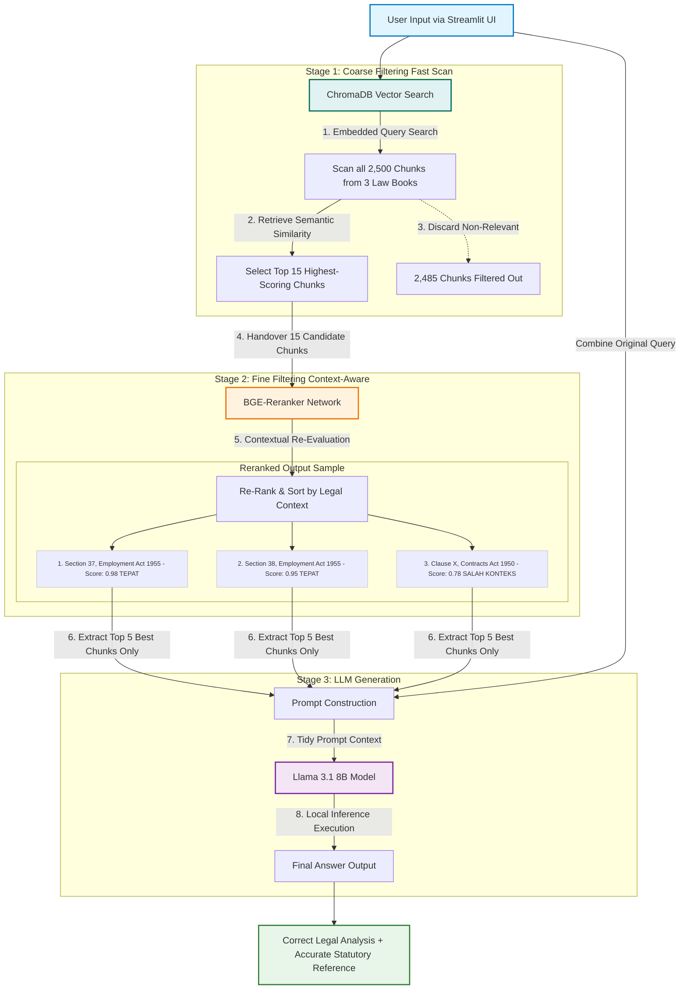

# ⚖️ AI Contract Analyzer Using Advanced RAG and LLM

A localized, privacy-focused Legal Contract Analysis assistant explicitly built for the Malaysian legal context. This system utilizes a **advanced Retrieval-Augmented Generation (RAG)** pipeline to evaluate employment/commercial contract clauses against local statutes (e.g., Employment Act 1955). It is engineered to mitigate critical RAG limitations such as statutory reference mismatches, context fragmentation, and LLM hallucinations through a rigorous two-stage retrieval mechanism.


---

## 🎯 Key Project Objectives & Features
- **Privacy-Centric Architecture:** Entirely hosted and executed on local hardware, ensuring high-stakes legal documents and contracts are never exposed to external third-party APIs.
- **Two-Stage Retrieval System:** Combines high-speed semantic vector searching with context-dense re-ranking models to handle precise statutory references.
- **Hallucination Mitigation:** Successfully resolves the "correct analysis but wrong section reference" anomaly by providing the LLM with highly filtered, non-fragmented statutory contexts.
- **Dynamic Local UI:** A clean, intuitive Streamlit web interface designed for HR managers and legal practitioners to input contract clauses and instantly receive structured non-compliance risks and legal citations.

---

## 🏗️ System Architecture & Workflow

The core infrastructure features an isolated retrieval and generation pipeline. Instead of a single-pass lookup, candidate legal sections undergo multi-tiered filtering before entering the LLM's context window.



### 🔍 Deep-Dive Technical Explanation:

#### 1. Data Ingestion & Section-Based Chunking (`1_database_setup.py`)

* **Stuctured Parsing:** Raw statutory PDFs are not split by arbitrary character counts (which usually cuts an article or cross-reference in half). Instead, a custom **Regex-based segmentation script** identifies legal boundaries (e.g., `Section 60A`, `Seksyen 12`).
* **Chunk Isolation:** Each legal section is converted into an independent text object. Hardcoded metadata containing the exact Act name and Section Number is permanently bound to the vector payload.
* **Embedding Generation:** Chunks are vectorized using a domain-specific encoder (`Legal-BERT` / specialized transformer) and preserved locally within a high-performance **ChromaDB vector database**, totaling ~2,500 distinct legal datasets.

#### 2. Stage 1: Coarse Filtering (Vector Search)

* When a user inputs a contract clause (e.g., *Maternity leave of 60 days*), ChromaDB performs a dense mathematical vector similarity lookup across all 2,500 chunks instantly.
* To avoid missing critical sub-sections, the query breadth is opened up to extract the **Top 15 highest-scoring chunks ($top\_k = 15$)**. The remaining 2,485 irrelevant sections are immediately pruned to conserve computational resources.

#### 3. Stage 2: Fine Filtering (BGE-Reranker Optimization)

* Semantic vector similarity often suffers from "lexical overlaps" where unrelated acts are pulled because they share similar wording (e.g., matching a payment clause from the Contracts Act instead of the Employment Act).
* The 15 candidate chunks are forwarded to the **BGE-Reranker model**. The re-ranker evaluates the deep contextual and structural logic between the user's clause and the statutory text, re-sorting the list.
* It filters out low-context noise, selects only the **Top 5 most precise chunks**, and guarantees that the legally binding statutory reference sits at Rank 1 or Rank 2.

#### 4. Stage 3: Context-Injected Generation (`2_chatbot.py`)

* The verified Top 5 chunks are structured into an engineered system prompt.
* The **Llama 3.1 (8B Parameters)** model executes local inference inside the environment. Because its input window is strictly constrained to the flawless legal text provided by the re-ranker, the model produces highly accurate non-compliance risk breakdowns alongside the correct statutory numbers without hallucinations.

---

## 📁 Repository Structure

```text
├── Database_Akta/       # Local repository containing raw Malaysian law PDF documents
├── 1_database_setup.py  # Pipeline script for Regex-splitting, embedding generation, and ChromaDB indexing
├── 2_chatbot.py         # Streamlit UI engine managing prompt engineering, Reranker routing, and Llama 3.1 inference
├── .gitignore           # Crucial file ensuring local models, environments, and secret tokens are kept locally
└── README.md            # Comprehensive system documentation and operational workflow (This file)

```

---

## 🛠️ Installation & Execution Guide

Follow these steps to deploy and run the local AI Contract Analyzer environment on your hardware:

### 1. Clone the Repository

```bash
git clone [https://github.com/Amca20/Ai-Contract-Analyzer-using-RAG-and-LLM.git](https://github.com/Amca20/Ai-Contract-Analyzer-using-RAG-and-LLM.git)
cd Ai-Contract-Analyzer-using-RAG-and-LLM

```

### 2. Isolate with a Local Virtual Environment

To prevent package conflicts with global system interpreters, initialize an isolated virtual python environment (ensure you name it `env` to naturally engage the pre-configured `.gitignore` blocks):

```bash
python -m venv env

```

Activate the environment:

* **Windows (Command Prompt):** `env\Scripts\activate`
* **Windows (PowerShell):** `.\env\Scripts\Activate.ps1`
* **Mac/Linux:** `source env/bin/activate`

### 3. Install Machine Learning & Web Frameworks

Execute the setup package downloads. Ensure your local hardware has CUDA paths configured if leveraging local GPU acceleration for runtime execution:

```bash
pip install langchain chromadb streamlit torch transformers sentence-transformers python-dotenv

```

### 4. Build and Populate the Vector DB

Ensure your raw Malaysian Law text documents are positioned cleanly inside the `Database_Akta/` root directory. Run the core compiler to split and ingest the legal embeddings:

```bash
python 1_database_setup.py

```

### 5. Launch the Streamlit Interface

Execute the active chatbot script to open up the interactive system inside your default web browser:

```bash
streamlit run 2_chatbot.py

```

---

## 🧑‍💻 Author & Project Attribution

This project was designed, developed, and evaluated by **Muhammad Amsyar Bin Hazalan** as a Final Year Project (FYP).

